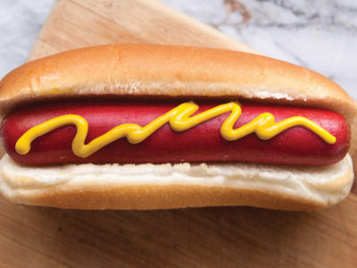

# CoolMosaic

Upload an image and give a keyword and we'll give you a mosaic of your image made with images of your keyword.

This program crawls Google images and Bing images, which unfortunately only return the first page for each (~50 images total).

Before:

Mosaic created using the keyword **hamburger**:

## Todo:
- when number of pictures gets large, will need to calculate `image_utils.py::getMostAppropriateColour` using an OctTree instead of Eucleadian distance
